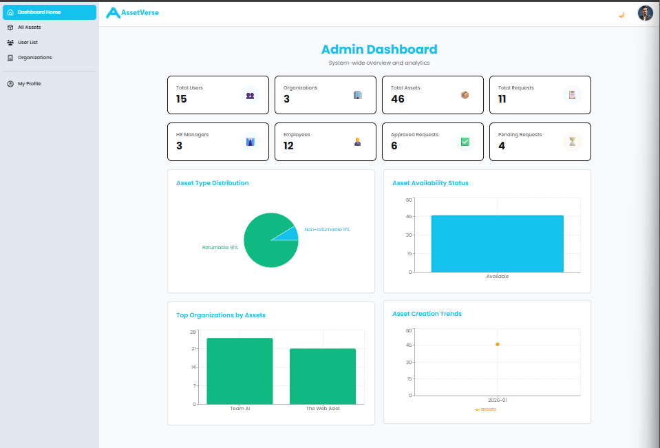
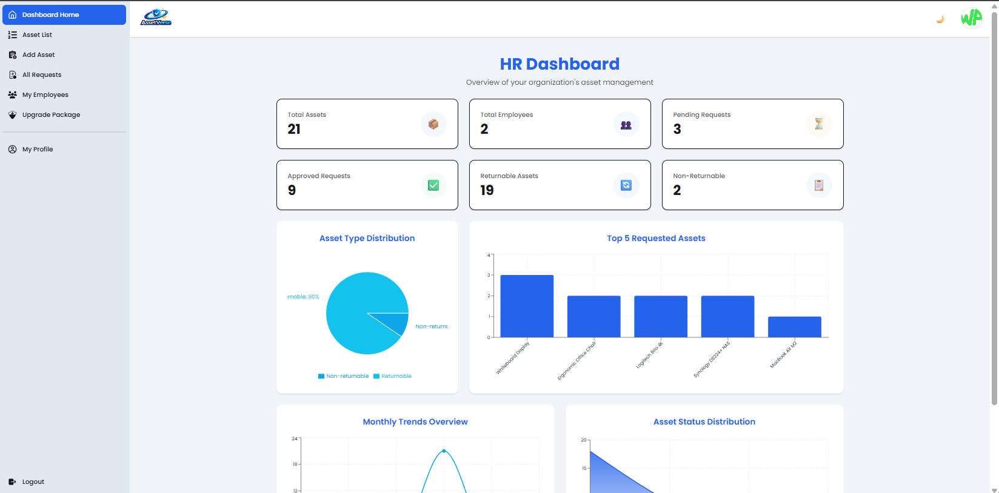
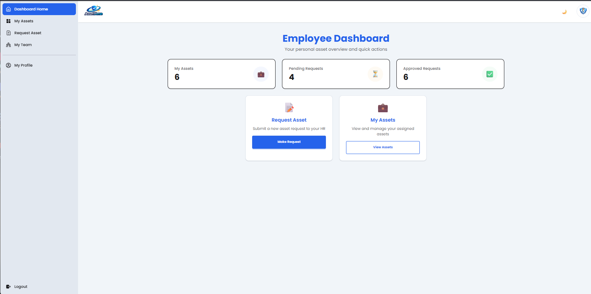
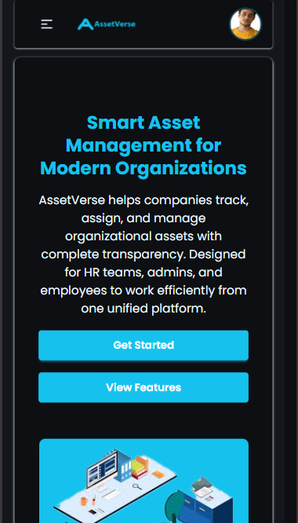
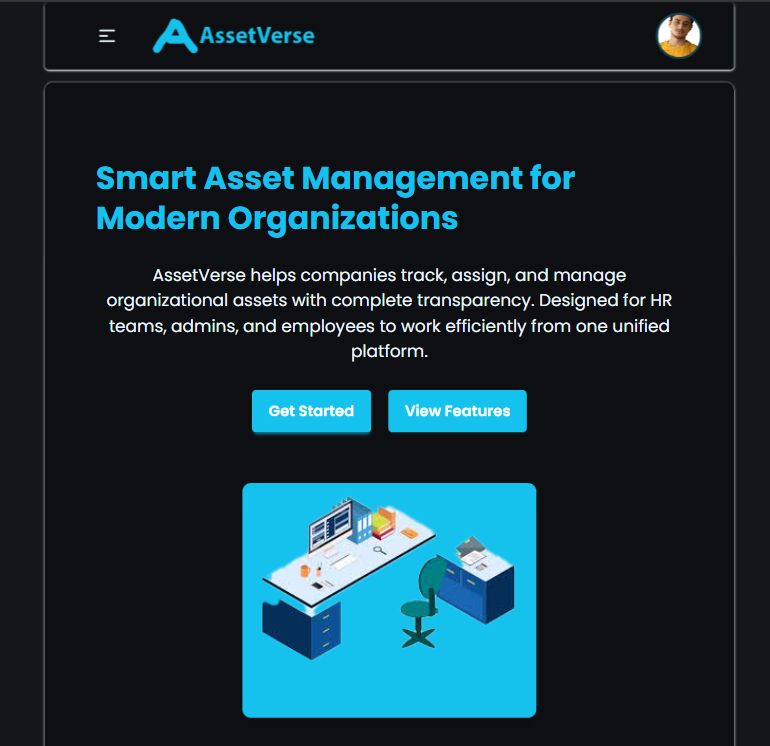
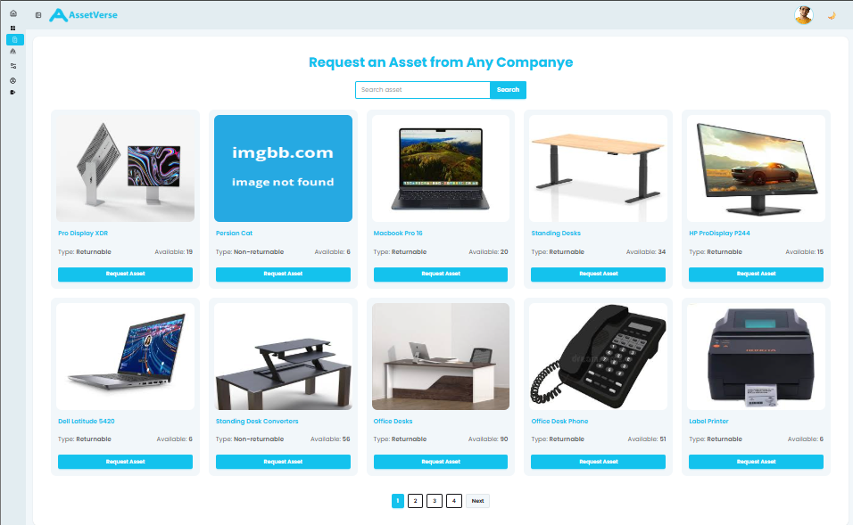

# AssetVerse

**Purpose:** Corporate Asset Management System

**Live URL:** [(https://asset-verse-mobin.pages.dev)]

---

## Key Features

- **HR Dashboard**: View and manage company assets and employees.
- **Asset Management**:
  - Add, edit, and delete assets
  - Upload product images via ImgBB
  - Track asset type, quantity, and company affiliation
- **Employee Management**:
  - View employees with photo, name, email, join date, and assets count
  - Remove employees from team with confirmation
- **Search Functionality**: Search assets and employees
- **Responsive UI**: Built with TailwindCSS and DaisyUI
- **Interactive Dialogs**: SweetAlert2 for confirmations and notifications
- **React Query**: Handles data fetching and caching

---

## NPM Packages Used

- `react` – Core React libraries
- `react-router` – Frontend routing
- `react-hook-form` – Form management
- `@tanstack/react-query` – Data fetching and caching
- `axios` – HTTP requests
- `sweetalert2` – Alert and confirmation dialogs
- `tailwindcss` & `daisyui` – Styling and UI components
- `react-helmet` – Dynamic page titles
- `vite` – Build tool

---

## Screenshots

### Dashboards

_Admin Dashboard - Overview of all company assets and management controls_

_HR Dashboard - Human Resources asset management interface_

_Employee Dashboard - Personal asset view and request management_

### Asset Views

_Mobile-responsive asset listing view_

_Tablet-optimized asset management interface_

_Detailed asset information and management screen_
